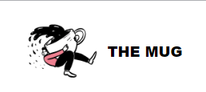
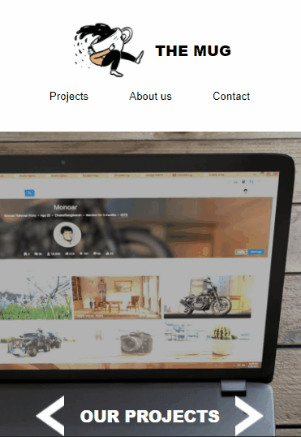

<h1 align='center'> The Mug - Digital Agc </h1>

_Para a versão em Português, clique [aqui](#portuguese)._

   

### Topics

- [Project description](#project-description)

- [Technologies used](#technologies-used)

- [What I learned](#what-I-learned)

- [Access the Project](#access-the-project)

## Project description

This is a landing page for a fictitious digital agency. This project was created during the frontend development course [DevQuest](https://devemdobro.com/lista/) in the Intermediate HTML and CSS module.

## Technologies used

  
  
   

## What I learned

- I learned how to create a carousel to display images from the agency's projects, using functions and 'arrow functions' so that when each image is clicked on, the previous one 'fades out' and displays the next image.

## Access the Project

You can [access the project here](https://bo83dev.github.io/digital-agc/) 

Mobile

Desktop 

Tablet

<h1 align='center'> The Mug - Digital Agc </h1>

   

### Tópicos 

- [Descrição do projeto](#descrição-do-projeto)

- [Tecnologias utilizadas](#tecnologias-utilizadas)

- [O que aprendi](#o-que-aprendi)

- [Acesse o projeto](#acesse-o-projeto)

## Descrição do projeto 

Essa é uma landing page de uma agência digital fictícia. Esse projeto foi criado durante o curso de desenvolvimento frontend [DevQuest](https://devemdobro.com/lista/) no módulo de HTML e CSS Intermediário.

## Tecnologias utilizadas

  
  
   

## O que aprendi

- Aprendi a criar um carrossel para exibir imagens dos projetos da agência, usando functions e 'arrow functions' para que quando cada imagem for clicada a anterior 'suma' e exiba a próxima imagem.

## Acesse o projeto

Você pode [acessar o projeto aqui](https://github.com/camilafernanda/GlicoCare) 

Mobile

Desktop 

Tablet

   
Developed with 🧡 by [@Carol Vilar](https://www.linkedin.com/in/carolinebarbosavilar/)
